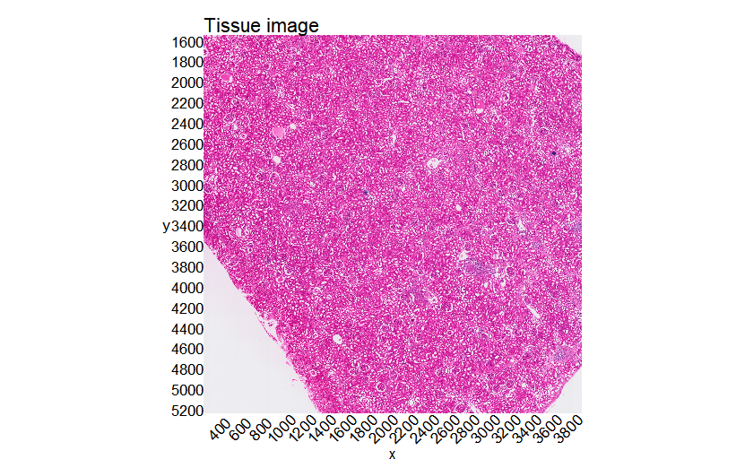
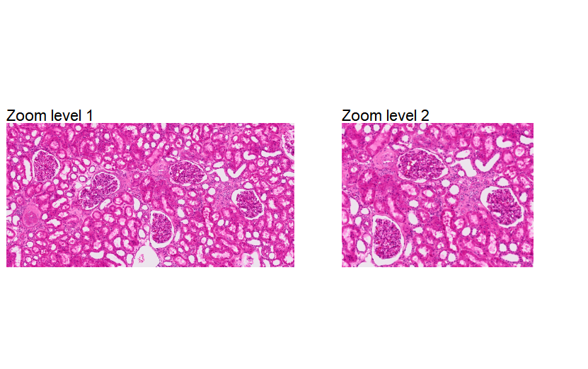
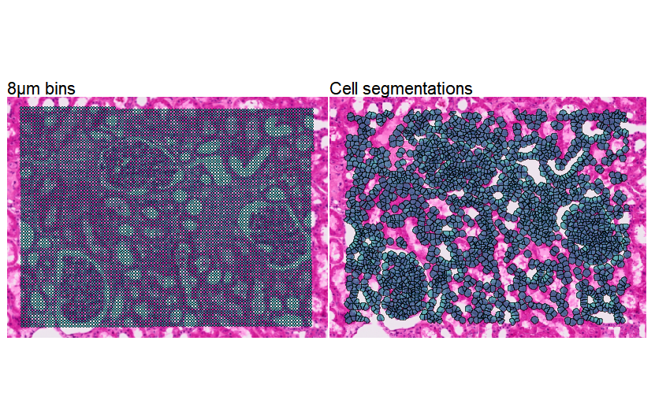
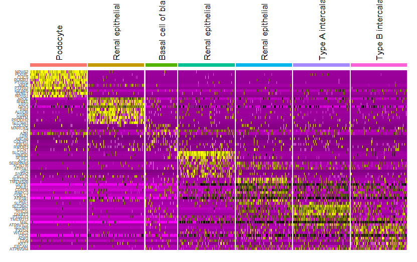
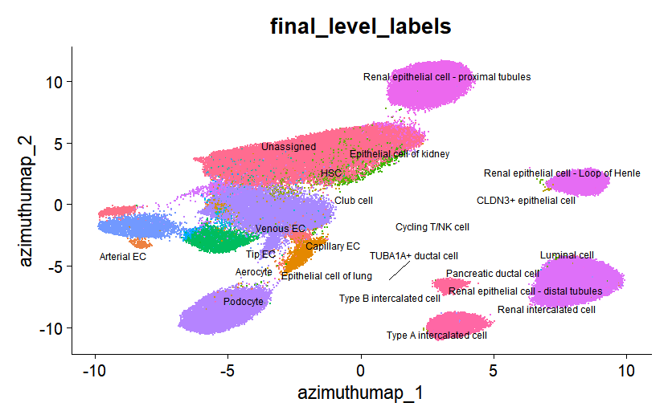
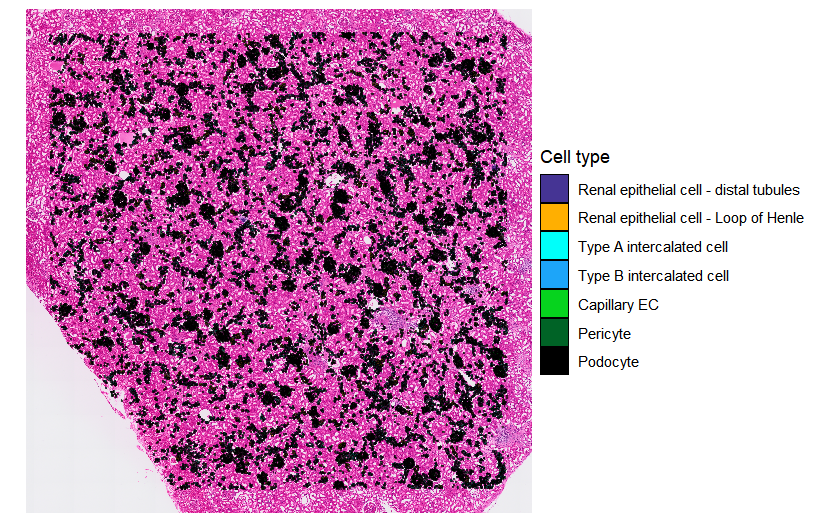
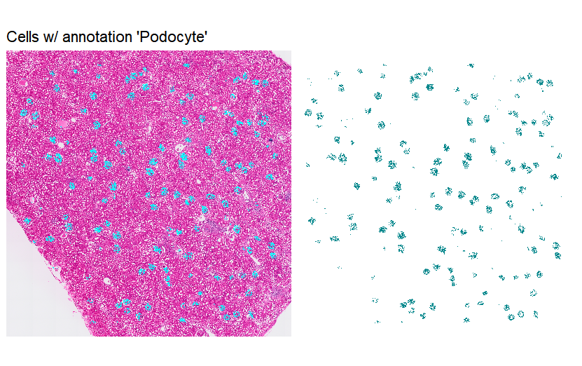
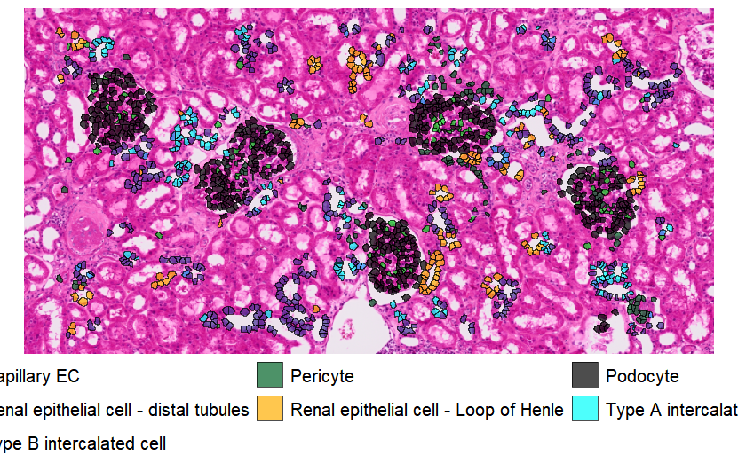

## 📊 핵심 분석 워크플로우 및 결과 (Analysis Workflow)

> **💡 아래의 스크립트 이름을 클릭하면 해당 소스 코드로 바로 이동합니다.**

| 단계 | 분석 스크립트 (Script) | 시각화 결과물 (Outputs) | 주요 분석 내용 (Description) |
| :---: | :--- | :--- | :--- |
| **Step 1** | **[Bins vs. segmentations.R](./Bins%20vs.%20segmentations.R)** |    | 신장 조직의 기본 축을 세팅하고, 8µm 바둑판 배열(Binning)과 세포 분할(Segmentation)의 공간 분해능 차이를 렌더링하여 비교합니다. |
| **Step 2** | **[Cell type annotation with Pan-human Azimuth.R](./Cell%20type%20annotation%20with%20Pan-human%20Azimuth.R)** |   | Pan-human Azimuth 레퍼런스를 활용하여 전사체 데이터를 기반으로 마커 유전자 발현(Heatmap)을 확인하고, UMAP 공간에서 세포 군집을 주석(Annotation) 처리합니다. |
| **Step 3** | **[Cell type annotations in spatial context.R](./Cell%20type%20annotations%20in%20spatial%20context.R)** |    | 식별된 세포 타입(예: 발세포 등)을 실제 조직의 물리적 위치에 다시 매핑하여, 사구체(Glomerulus) 등의 해부학적 구조와 세포 분포를 정밀하게 분석합니다. |
